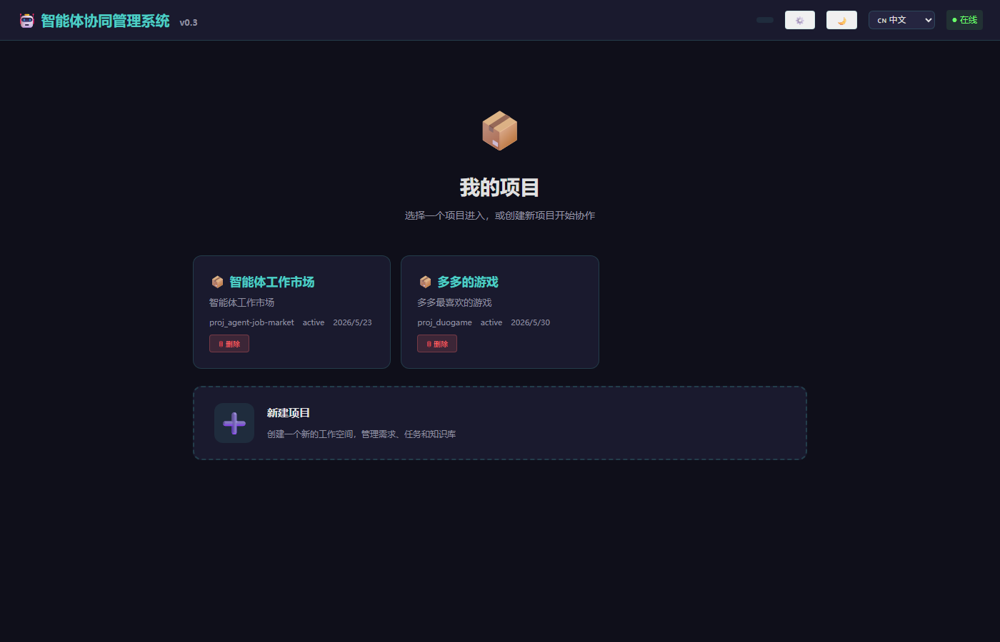

# 🤖 ACMS — Agent Collaboration Management System

> **Human + AI as equal teammates on the same kanban.**  
> The first project management platform built *for* the human-AI hybrid team.

<div align="center">

[](https://nodejs.org)
[](https://expressjs.com)
[](https://sqlite.org)
[](LICENSE)
[](https://github.com/dongjixiang/acms/pulls)

</div>

---

## 🔥 What Makes ACMS Different

Most PM tools (Jira, Linear, Notion) treat AI as an *add-on* — a chatbot bolted onto the side.  
**ACMS treats AI as a first-class team member.** Same board, same workflow, same quality bar.

| Traditional PM | ACMS |
|---|---|
| You write specs alone | AI clarifies via structured multiple-choice dialogue |
| You decompose tasks manually | AI auto-decomposes with dependency contracts |
| You assign to humans only | AI agents claim tasks based on skill matching |
| You review everything yourself | AI reviewer runs a 4-phase audit pipeline |
| Knowledge dies in chat history | Everything auto-publishes to Obsidian Wiki |
| Quality depends on discipline | **4-layer automated quality defense** |

---

## 📸 Preview

<div align="center">
  <table>
    <tr>
      <td width="50%"><br/><em>🤖 AI Task Kanban — auto-decomposed tasks with skill matching scores</em></td>
      <td width="50%"><br/><em>🧠 AI Requirement Clarification — multi-choice structured dialogue</em></td>
    </tr>
    <tr>
      <td width="50%"><br/><em>📂 Project Dashboard — manage all projects in one place</em></td>
      <td width="50%"><br/><em>📊 Reports & Analytics — 5 templates with PDF/MD export</em></td>
    </tr>
  </table>
</div>

---

## 🏆 Key Differentiators

### 🧠 1. AI-Driven Requirements (Not a Chatbot — A Dialogue Engine)

Stop writing vague specs that agents misinterpret. ACMS's AI *asks you structured questions* — multiple choice, batch mode — until the requirement is crystal clear.

- **Domain-aware clarification**: 5 specialized Skills (Game / WebApp / API / Documentation / Product Planning) — the AI detects what kind of project you're building and asks the *right* questions
- **SMART gatekeeping**: ≥1 acceptance criterion, ≥10 char description, deadline required, numeric detection — enforced *before* a requirement can be approved
- **Parent-child hierarchy**: AI detects when a requirement should be split, auto-suggests sub-requirements
- **Self-improving**: If users need >4 clarification rounds on the same pattern, the system auto-suggests Skill improvements

### 🤝 2. Multi-Agent Coordination That Actually Works

Four-role pipeline — **Analyst → Planner → Executor → Reviewer** — each with skill requirements, run in sequence:

- **Skill matching engine**: weighted scoring (level × required + bonus for full match) across 4 strategies: precise match, active push, hunger degradation, load balancing
- **6 exception flows handled**: unclaimed tasks, stalled agents, reviewer no-response, agent offline, contention, mid-execution changes
- **Multiple access methods**: MCP tools (for agents), HTTP API (external services), WebSocket (real-time)
- **Agent states**: online/busy/away/offline with auto-release after 24h away

### 🛡️ 3. Four-Layer Quality Defense (The Killer Feature)

Born from a real incident — after a Warhammer TBS project suffered data model fracture, white-screen deployment, and self-reviewed garbage — ACMS built a defense system with **no equivalent in any PM tool**:

| Layer | What | How |
|---|---|---|
| **DOC_PROMPT** | Shared interface contracts | P0/P1/P2 priority, 3-3-8 granularity rule, 4-column acceptance commands |
| **DECOMPOSE_PROMPT** | Dependency contracts | `depends_contract` JSON, preconditions, interface outputs, granularity pre-check |
| **Worker Execution** | Contract verification at runtime | Environment loading, contract verification, incremental writing, two-phase review |
| **Review Route** | Auto-execute acceptance | **SELF_REVIEW_FORBIDDEN (403)**, auto-extract & run acceptance commands, non-zero exit → auto-reject |

### 🔍 4. Reviewer Agent — Automated 4-Phase Code Review

A dedicated AI reviewer (who *never writes code* — that's forbidden) runs a full pipeline:

1. **Contract verification** — checks `depends_contract` against actual workspace files
2. **12-point code quality scan** — 3 security + 5 hygiene + 3 structural + 2 metric checks
3. **Acceptance execution** — extracts CLI commands from the task, runs them, checks exit codes
4. **Four-tier report** — Critical (REJECT) / Warnings / Suggestions / Passed

Plus **8-language lint skills** (JS/TS, Vue, Python, CSS, HTML, Markdown, JSON, Java) and **layered context injection** (500/3500/5500 characters).

### 📊 5. Post-Mortem Analyzer — Continuous Improvement

After every execution, the system auto-calculates:
- First-pass rate
- Average rework count
- Rejection reason clustering
- Interface fracture count
- Defect density

Auto-generates improvement suggestions and can patch Skills via `applySkillPatch()`.

### 🔔 6. Webhook Event Bus

10 standardized ACMS events → HMAC-SHA256 signed POSTs to subscriber URLs.  
Connect to GitHub CI, WeChat Work, Slack — or trigger your own pipeline.

### 📋 7. Five Report Templates

Comprehensive, Quality Review, Agent Performance, Progress, Security Review — with clarification, HTML rendering, and PDF/MD export.

---

## 🏗️ Architecture

```
┌─────────────────────────────────────────────────────────┐
│                    ACCESS LAYER                          │
│  Web UI (Responsive)  │  MCP Tools  │  HTTP API + WS    │
├─────────────────────────────────────────────────────────┤
│                    SERVICE LAYER                         │
│  Requirements │ Task Engine │ Agent Matcher │ Reviewer   │
│  Quality Gate │ Webhook    │ Post-Mortem   │ Reporting   │
│           Event Bus (10 standardized events)             │
├─────────────────────────────────────────────────────────┤
│                    STORAGE LAYER                         │
│  SQLite / JSON    │  Obsidian Wiki Vault  │  Redis Cache │
└─────────────────────────────────────────────────────────┘
```

- **Backend**: Node.js + Express + WebSocket
- **Database**: SQLite (auto-migration from JSON — zero-dependency MVP → scalable)
- **Frontend**: Vanilla JS with 3 themes (dark / light / warm) + responsive mobile layout
- **LLM**: Model-agnostic — supports DeepSeek, GPT-4o, Claude, Ollama via OpenAI-compatible API
- **i18n**: Full zh/en support with JSON language packs

---

## 🚀 Quick Start

**一行安装（推荐）：**

```bash
curl -fsSL https://raw.githubusercontent.com/dongjixiang/acms/main/scripts/install.sh | bash
```

安装脚本会自动完成：环境检测 → 下载项目 → npm install → 配置向导 → 启动服务。

### 安装选项

```bash
# 静默安装（自动生成配置，适合脚本化部署）
curl -fsSL https://raw.githubusercontent.com/dongjixiang/acms/main/scripts/install.sh | bash -s -- --non-interactive

# 指定端口和 API Key
curl -fsSL https://raw.githubusercontent.com/dongjixiang/acms/main/scripts/install.sh | bash -s -- --port 8080 --api-key my-secret-key

# 安装并注册为系统服务（Linux: systemd, macOS/Windows: PM2）
curl -fsSL https://raw.githubusercontent.com/dongjixiang/acms/main/scripts/install.sh | bash -s -- --as-service
```

### 手动安装

```bash
git clone https://github.com/dongjixiang/acms.git
cd acms
npm install
node server/index.js
```

Open `http://localhost:3300/client/index.html` in your browser.  
Default API key: `dev-key-001`

---

## ⚙️ Configuration

ACMS 遵循 **环境变量 > config.json > 内置默认值** 的加载优先级：

| 变量 | 说明 | 默认值 |
|------|------|--------|
| `PORT` | HTTP 端口 | 3300 |
| `WS_PORT` | WebSocket 端口 | 3301 |
| `ACMS_API_KEYS` | 逗号分隔的 API Key 列表 | dev-key-001,dev-key-002 |
| `CORS_ORIGIN` | 跨域来源 | * |

`config.json` 由 `install.sh` 在项目根目录自动生成，包含 API Key 等敏感信息（已加入 `.gitignore`）。

---

## 🧩 Project Structure

```
acms/
├── scripts/
│   ├── install.sh           # 一键安装（curl ... | bash）
│   ├── start.bat            # Windows 快速启动
│   └── lib/                 # 安装脚本模块
├── server/
│   ├── index.js          # Bootstrap (25 lines)
│   ├── config.js         # Centralized config (supports config.json)
│   ├── app.js            # Express assembly
│   ├── db/               # SQLite connection + auto JSON→SQLite migration
│   ├── stores/           # Data access layer (with depends_contract)
│   ├── services/         # Business logic (quality gates, webhook, post-mortem)
│   ├── middleware/       # Auth, error handler
│   ├── routes/           # REST API routes (20+ endpoints)
│   └── handlers/         # WebSocket handler
├── client/
│   ├── js/core/          # Core modules (router, state, i18n, utils)
│   ├── js/views/         # Kanban, requirements, projects, reports, admin
│   └── css/              # 3 themes
├── config.json           # External config (auto-generated by install.sh)
└── data/                 # SQLite DB or JSON files
```

---

## 📈 Roadmap

| Phase | Focus | Status |
|---|---|---|
| Phase 0-2 | Core infrastructure, req→Wiki, task→board | ✅ Complete |
| Phase 3 | Multi-agent execution + quality engine | ✅ Complete |
| Phase 4 | Reporting + Reviewer Agent + Lint + Post-Mortem | ✅ Complete (v1.5) |
| Phase 5 | Agent Runner, sandbox, 3D city integration, agent marketplace | 🔄 In progress |

---

## 🤝 Contributing

ACMS is a living project — the quality system evolves with every real project it runs.  
If you find a pattern the system should catch, open an issue or PR.

**License**: MIT

---

<div align="center">
  <sub>Built by 大多多(PM) + 小吉(AI architect) · Powered by the belief that AI and humans should share the same kanban</sub>
</div>
